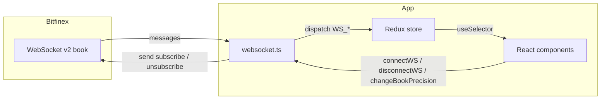

# Bitfinex-style order book — implementation guide

This document describes how the live order book feature is built in this Expo / React Native app, so you can walk someone through the architecture, data flow, and UI without reading every file.

---

## 1. What the app does (product summary)

- Connects to **Bitfinex public WebSocket v2** for the **`book`** channel on a default symbol (**`tBTCUSD`**).
- Keeps a **local order book** (bids / asks) in **Redux** and renders:
  - **Home:** compact ladder (~10 rows), Book / Depth Chart tabs, **P0–P4** precision controls, **FULL BOOK** navigation, connection toolbar.
  - **Full book:** all levels in a **FlatList** (virtualized), neutral styling, **safe area** + **status bar**, **hardware back** returns home.
- **Disconnect** stops the feed; **reconnect** after network loss is handled in the WebSocket layer.
- **Precision changes** unsubscribe the old channel and subscribe again at **`P{n}`** so the ladder matches Bitfinex grouping.

---

## 2. Tech stack

| Layer | Choice |
|--------|--------|
| Framework | Expo (React Native) |
| Routing | Expo Router (`app/` file-based routes) |
| State | Redux (`legacy_createStore` + single reducer) |
| Realtime | Browser/React Native `WebSocket` → Bitfinex `wss://api-pub.bitfinex.com/ws/2` |
| Gestures / touch | `react-native-gesture-handler` root |
| Safe area | `react-native-safe-area-context` |
| Long lists | `FlatList` (home compact book + full book), fixed **`ROW_HEIGHT`** + **`getItemLayout`** |

---

## 3. Repository layout (high level)

```
app/
  _layout.tsx      # Provider, SafeAreaProvider, Stack, GestureHandlerRootView
  index.tsx        # Re-exports HomeScreen
  full-book.tsx    # Re-exports FullBookScreen

src/
  screens/         # Screen implementations (logic + layout)
  components/      # Reusable UI (order book, toolbar, footer, connection, nav bar)
  services/        # websocket.ts — connect, reconnect, subscribe, precision change
  store/           # Redux store + orderBookReducer
  constants/       # colors, strings, layout tokens, order book config
```

**Why two folders for routes?**  
`app/` stays **thin** so Expo Router only maps URLs → screens. Real UI lives under **`src/screens`** for clarity and reuse.

---

## 4. Runtime data flow



1. **HomeScreen** calls **`connectWS(handlers, DEFAULT_BOOK_SYMBOL)`** with stable handler objects that **dispatch** Redux actions (`WS_CONNECTING`, `WS_MESSAGE`, `WS_CONNECTED`, etc.).
2. **`websocket.ts`** opens the socket, sends **`subscribe`** with `prec: P{n}`, `len`, `freq`, etc.
3. Incoming **array payloads** (channel updates) are passed to **`dispatch({ type: 'WS_MESSAGE', payload })`**.
4. **`orderBookReducer`** parses:
   - JSON **events** (`subscribed`, `error`, `pong` handling in service),
   - **Book snapshots** (first large array of `[price, count, amount]` rows),
   - **Deltas** (same tuple shape; `count === 0` removes a level).
5. **UI** reads **`bids` / `asks`** as `Record<string, BookSideEntry>` and sorts/renders via **`OrderBookRowParts`**.

---

## 5. Redux state shape (`orderBookReducer`)

| Field | Role |
|--------|------|
| `bids` / `asks` | Price-keyed maps; positive `amount` → bid, negative → ask |
| `connectionStatus` | `disconnected` \| `connecting` \| `connected` |
| `error` | User-visible string or `null` |
| `hasSnapshot` | First book message treated as full snapshot |
| `bookChanId` | Channel id from `subscribed` — used to ignore stale channel and to **unsubscribe** on precision change |
| `bookPrecIndex` | **P0–P4** index; persisted when disconnected, applied on next subscribe |

Important actions (names only): `WS_CONNECTING`, `WS_CONNECTED`, `WS_DISCONNECTED`, `WS_STREAM_LOST`, `WS_STREAM_RECONNECTING`, `WS_MESSAGE`, `CLEAR_BOOK_FOR_PREC`, `SET_BOOK_PREC_INDEX`.

---

## 6. WebSocket service (`src/services/websocket.ts`)

- **Single module-level socket** + reconnect timer + **`manualClosePending`** so user **Disconnect** does not fight auto-reconnect.
- **`changeBookPrecision`**: clamps index **0–4**, dispatches **`CLEAR_BOOK_FOR_PREC`** + **`SET_BOOK_PREC_INDEX`**, **unsubscribes** old `chanId` if open, then **subscribes** again with new **`P{n}`**.
- **`subscribeBook`** reads current precision from the store so reconnects stay in sync.
- Errors and parse failures surface via **`Strings.errors.*`** and handlers.

---

## 7. UI structure

### 7.1 Home (`src/screens/HomeScreen.tsx`)

- **SafeAreaView** (top / left / right).
- **ConnectionToolbar** — Connect / Disconnect.
- **ConnectionStatusRow** — status + error line.
- **OrderBook** — main card.

### 7.2 Order book card (`src/components/OrderBook.tsx`)

- Loading / empty / error / reconnect banners.
- **OrderBookToolbar** — row 1: **ORDER BOOK** + **Book | Depth Chart**; row 2: precision caption + **− / +** (no on-screen **P** label; a11y describes level).
- **`FlatList`** with **`ListHeaderComponent`** = **`OrderBookColumnHeaders`** (`useAmountLabel`, memoized), **`ListFooterComponent`** = **`OrderBookFooter`** (memoized; scrolls with rows). On **Depth Chart** tab the footer is rendered **below** the placeholder only (not inside a list).
- **List tuning:** `useCallback` for **`renderItem`**, **`keyExtractor`**, **`getItemLayout`** (fixed **`ROW_HEIGHT`**); **`useMemo`** for **`listExtraData`** `{ bookPrecIndex, depthFactor, maxBidCum, maxAskCum }` so rows refresh when precision/depth scaling changes even if the row array reference is stable; **`removeClippedSubviews={false}`** because rows use **absolutely positioned** depth bars (clipping would break them).
- **Depth bars** use a fixed scale index **`DEFAULT_DEPTH_BAR_SCALE_INDEX`** (100% width factor); footer **+/−** depth controls were removed.
- **OrderBookFooter** — single row, **`justifyContent: 'flex-end'`**: **FULL BOOK** (tap) grouped with **●** **THROTTLED 5S** on the **trailing edge** (decorative label; not a coded 5s throttle).

### 7.3 Rows & formatting (`src/components/OrderBookRowParts.tsx`)

- **`getSortedBookSides`** — sort bids desc, asks asc.
- **`buildRowModels`** — zip sides with **cumulative** totals for bar width.
- **`formatPrice` / `formatTotal`** — compact book; **`formatPriceDetail`** — full book.
- **`ROW_HEIGHT`** — used by **`getItemLayout`** in both lists for scroll offset math.
- **`OrderBookRowView`** / **`OrderBookDetailRowView`** are **`memo(...)`** wrappers around inner components (`OrderBookRowViewInner`, `OrderBookDetailRowViewInner`). Use the **inner function + `memo(Inner)`** pattern (not `memo(function Name() {})`) so **Metro’s Babel parser** does not mis-parse the closing tokens.
- **OB_COLORS** / **DETAIL_COLORS** imported from **`src/constants/colors.ts`** and re-exported for backward compatibility.

### 7.4 Full book (`src/screens/FullBookScreen.tsx`)

- **`StatusBar`** (light), **top/bottom insets** for content.
- **ScreenNavBar** + **`router.replace('/')`** for back (and **BackHandler** on Android).
- **Meta row** above the card: live / status line + **level count** (`Strings.fullBook.levelsCount`).
- **`FlatList`** with **`data={allRows}`**, **`ListHeaderComponent`** = **`OrderBookColumnHeadersDetail`**, **`ListFooterComponent`** = bottom spacer (memoized **`View`**, replaces `paddingBottom` on **`contentContainerStyle`**). Memoized **`renderItem`** / **`keyExtractor`** / **`getItemLayout`** (row items only). **`contentContainerStyle`**: **`flexGrow: 1`**. **`removeClippedSubviews`** on **Android** only. Tunables: **`initialNumToRender`**, **`maxToRenderPerBatch`**, **`windowSize`**.
- **No API pagination:** the full ladder is already in Redux from the WebSocket; **`FlatList`** only virtualizes which rows are mounted, not “load more pages.”

---

## 8. Constants (single source of truth)

| File | Contents |
|------|-----------|
| `src/constants/colors.ts` | Palettes: order book, detail screen, app shell, connection, status, semantic (link, banners) |
| `src/constants/strings.ts` | All user-visible copy + a11y strings + `connectionStatusLabel` |
| `src/constants/layout.ts` | Font sizes, weights, radii, opacity, spacing |
| `src/constants/orderBook.ts` | `DEFAULT_BOOK_SYMBOL`, row counts, `BOOK_WS_LEN`, `DEPTH_BAR_SCALES`, `DEFAULT_DEPTH_BAR_SCALE_INDEX`, `BOOK_PREC_*` |

---

## 9. Navigation

| Route | File | Screen |
|-------|------|--------|
| `/` | `app/index.tsx` | `HomeScreen` |
| `/full-book` | `app/full-book.tsx` | `FullBookScreen` |

**Full book back behavior:** **`replace('/')`** avoids a fragile stack back in some cases; hardware back uses the same handler.

---

## 10. Optimization — what’s already in place & what’s optional

**Already implemented**

- **`FlatList`** on home (compact book) and full book — virtualizes rows instead of mounting the entire ladder.
- **`getItemLayout`** using **`ROW_HEIGHT`** — fewer measure passes during scroll (if row height ever diverges from `ROW_HEIGHT`, e.g. hairline borders on detail rows, adjust the constant or drop **`getItemLayout`**).
- **`extraData`** on the home list — keeps cells correct when **`bookPrecIndex`** / depth factors / max cumulatives change without a new **`data`** reference.
- **`useCallback` / `useMemo`** on list callbacks and container styles where it matters.
- **`React.memo`** on row components (via **`memo(Inner)`** pattern for Metro compatibility).

**Optional next steps (only if profiling shows need)**

1. **Narrow `useSelector`** — connection-only UI can subscribe to **`connectionStatus`** / **`error`** alone to avoid redundant work when only the book map changes (small win).

2. **Throttling / batching Redux** — reduces renders, **changes** perceived latency. The footer **THROTTLED 5S** text is **not** an implementation of server-side throttling.

3. **`Immer` or normalized book state** — larger refactors; not zero-risk.

**Build / runtime**

- **Hermes** + production builds; avoid verbose logging in hot paths.

**Bottom line:** Book ticks will still drive frequent updates; that’s expected. **`FlatList`** + **`memo`** + stable **`renderItem`** are the main UI-side wins without changing product behavior.

---

## 11. How to explain this in one minute

> “We use Expo Router for two screens. Redux holds the book and connection state. A WebSocket module talks to Bitfinex: on connect it subscribes to the book channel with precision P0–P4; every message goes through one reducer that applies snapshots and deltas. The home screen shows a compact virtualized book (**FlatList**), toolbar tabs, and precision **− / +**; changing precision unsubscribes and resubscribes. The full book screen is also a **FlatList** of all levels, with safe areas, status bar, and Android hardware back going home. Copy and colors live in **`src/constants`**.”

---

## 12. Key files checklist (for code walkthroughs)

| Topic | File(s) |
|--------|---------|
| Store setup | `src/store/store.ts`, `src/store/orderBookReducer.ts` |
| WebSocket | `src/services/websocket.ts` |
| Home UI | `src/screens/HomeScreen.tsx`, `src/components/OrderBook.tsx` |
| Toolbar / footer | `src/components/OrderBookToolbar.tsx`, `src/components/OrderBookFooter.tsx` |
| Rows / headers | `src/components/OrderBookRowParts.tsx` |
| Full book | `src/screens/FullBookScreen.tsx`, `src/components/ScreenNavBar.tsx` |
| Tokens | `src/constants/*.ts` |
| Entry / providers | `app/_layout.tsx` |

---

*Last updated: FlatList + list memoization, footer trailing group, `memo(Inner)` row pattern, and constants layout described above.*
